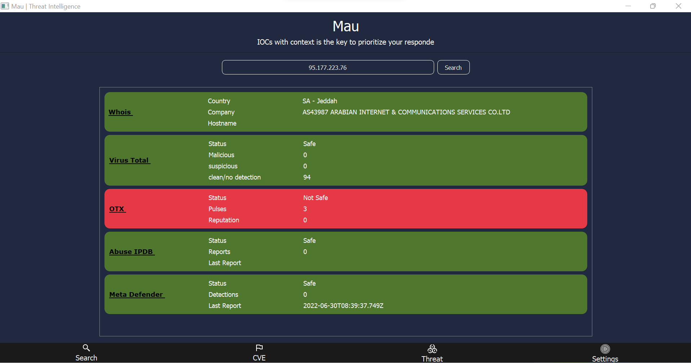

# Mau
As Mau helped the old Egyptians, It will help you

### Usage
Create file tokens.conf in the same directory of file (JSON) to add your own tokens.
```python
{"meta_scan": "","abuse_ip_db": "","otx":"","whois_token": "", "vt_token": ""}
```
Then open the app by double click mau.exe, put the IP or URL or Hash, for more details click on the site name.



### Build using pyinstaller
```python
\pyinstaller.exe --onefile --noconsole .\main.py

```

### Download
Go to wiki pages
